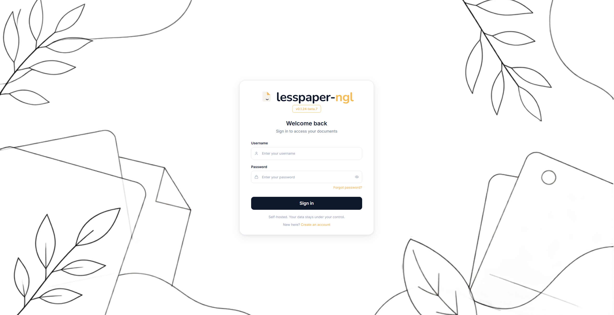
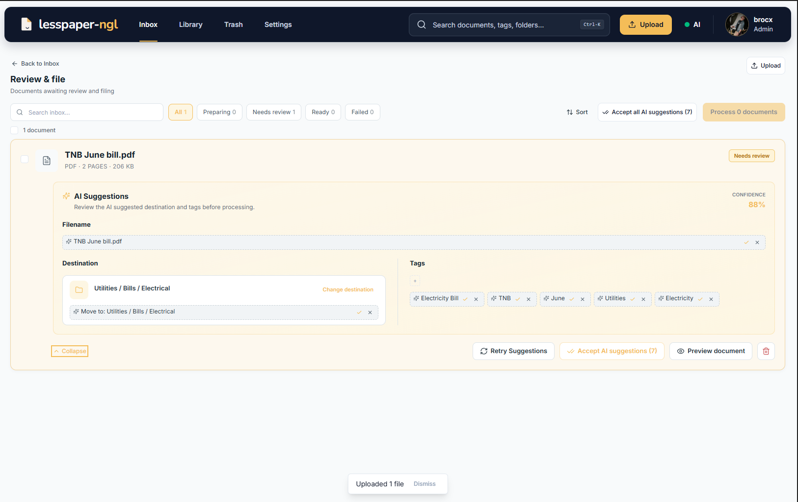
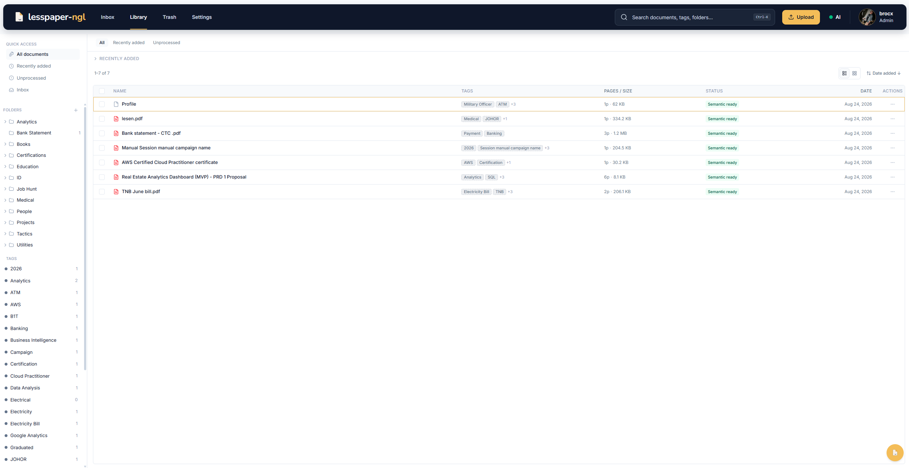
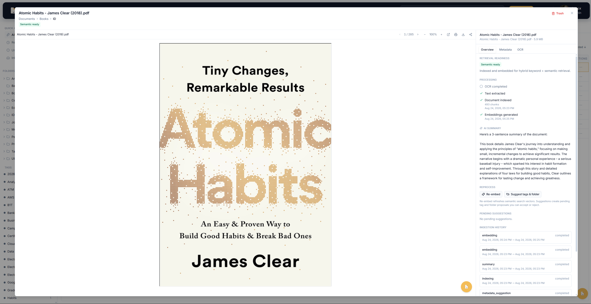
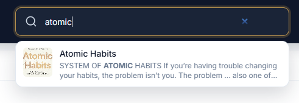
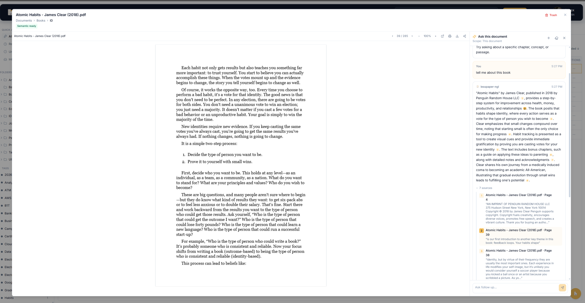
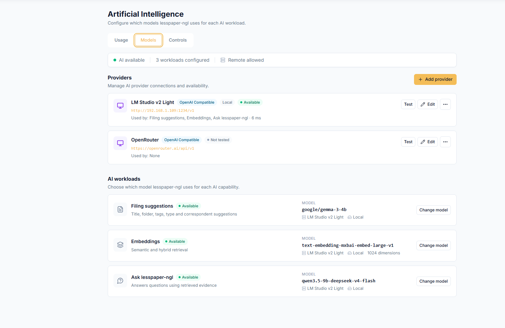

# lesspaper-ngl

### A self-hosted document manager for people who want less paper, ngl.



**Documents first. AI if you want it. Your server either way.**

  

---

## So, what is this?

You know the drill.

You download a PDF.

Then another.

Then somebody emails you `scan_0042.pdf`.

Six months later:

```text
Documents/
├── insurance/
│   ├── final.pdf
│   ├── final-final.pdf
│   └── final-final-USE-THIS.pdf
├── random/
└── definitely-important/
```

**lesspaper-ngl** is a self-hosted document manager for turning that mess into an organised, searchable library.

Drop documents in, extract their text, OCR the scans, review where they belong, rename, tag, file, find them later.

If you want AI, it can help suggest metadata, power semantic search, and answer questions from your documents.

If you don't?

That's fine too.

> **Document management first. AI on demand, not infrastructure.**

---


## Why lesspaper-ngl?

There are already excellent document-management projects out there.

Yes, we know about **Paperless-ngx**. The name is not an accident. :)

lesspaper-ngl lives in the same problem space, but has a few opinions of its own:

- humans should stay in control of filing
- search should not silently call an LLM
- AI suggestions should remain suggestions until you approve them
- OCR and keyword search should work without AI
- local AI should be a first-class option
- remote AI should be governed by explicit privacy controls
- your document library should remain useful even if every AI provider disappears tomorrow

This isn't "Paperless-ngx but better".

It's a different set of trade-offs.

---


## The workflow

lesspaper-ngl treats document ingestion as a small lifecycle rather than immediately throwing everything into a library.

```text
        Upload / Consume
              │
              ▼
           Inbox
              │
      ┌───────┴────────┐
      │                │
 Text extraction      OCR
      │                │
      └───────┬────────┘
              │
       optional AI
      filing suggestions
              │
              ▼
        Human review
              │
           Process
              │
              ▼
           Library
              │
      ┌───────┼─────────┐
      │       │         │
   Browse   Search     Ask
```


### Inbox

New documents land in the Inbox while lesspaper-ngl prepares them.

Depending on the file and your configuration, that may include:

- native text extraction
- local OCR
- thumbnails and previews
- optional AI filing suggestions



AI can suggest things like:

- title
- folder
- tags
- document type
- correspondent

But suggestions are **not canonical metadata until you accept them**.

### Process

**Process** is the deliberate filing gate.

Once you're happy with the destination and metadata, Process moves the document out of Inbox, resolves its logical folder, and prepares it for final retrieval indexing.

OCR finishing does **not** automatically mean a document has been filed.

### Library

The Library is your organised document corpus.



Documents can be arranged using:

- nested logical folders
- tags
- document types
- correspondents
- dates
- notes
- custom metadata




Logical organisation does not require physically moving the original file around your storage.

---


## Find stuff without asking a chatbot



Search and Ask are intentionally different things.

### Keyword search

PostgreSQL full-text search across document metadata and extracted page text.

No chat model involved.

### Semantic search

When an embedding provider is configured, document chunks can be embedded for vector similarity search.

### Hybrid search

Keyword and semantic retrieval can be combined to improve recall.

```text
Query
  │
  ├── Keyword search
  │
  └── Semantic search
          │
          ▼
       fused results
```

If embeddings are unavailable, lesspaper-ngl can continue operating with keyword retrieval.

---


## Ask your documents

When a chat model is configured, **Ask** lets you ask a question against a controlled scope of your library.



Ask can work against:

- one document
- selected documents
- a folder
- a folder and its descendants
- the entire library
- a frozen set of search results

The pipeline is deliberately evidence-first:

```text
Question
   │
   ▼
Retrieve relevant passages
   │
   ▼
Fit evidence into context
   │
   ▼
Chat model
   │
   ▼
Answer + validated citations
```


If the available evidence cannot support an answer, the expected outcome is:

> insufficient evidence

rather than quietly broadening the search or pretending the model knows more than your documents contain.

---


## AI, if you want it

lesspaper-ngl does **not** require AI to be a document manager.

Without a chat or embedding model you can still use:

- uploads
- watched-folder ingestion
- OCR
- folders
- tags
- metadata
- text extraction
- PostgreSQL full-text search
- document viewing
- keyword retrieval

AI adds optional capabilities such as:


| Capability                    | AI required? |
| ----------------------------- | ------------ |
| Upload and organise documents | No           |
| OCR scanned documents         | No           |
| Keyword search                | No           |
| Filing suggestions            | Yes          |
| Semantic search               | Yes          |
| Hybrid semantic retrieval     | Yes          |
| Ask / Q&A                     | Yes          |


Indexing itself does not require an LLM.

Embeddings are a separate optional step.

---

## MCP

lesspaper-ngl can expose your document library to compatible AI clients and agents through the **Model Context Protocol (MCP)**.

That means tools such as local agents, coding assistants, and other MCP-capable clients can use lesspaper-ngl as a controlled source of private document context without needing direct access to the underlying filesystem or database.

Conceptually:

```text
AI agent / MCP client
        │
        ▼
 lesspaper-ngl MCP
        │
        ├── search documents
        ├── retrieve evidence
        ├── inspect metadata
        └── work within authorised scope
                │
                ▼
             Library
```

The important bit is that MCP sits **on top of lesspaper-ngl's existing document and retrieval model**.

Agents should interact with the library through application-level permissions and retrieval primitives rather than bypassing them with raw filesystem access.

This keeps the same project principles intact:

* owner isolation
* explicit document scope
* evidence-first retrieval
* no mandatory external AI provider
* no direct database access required
* document-management rules remain authoritative

### Why MCP?

Because sometimes you don't want another chat UI.

You already have one of those.

MCP lets lesspaper-ngl act as the **document brain behind the tools you already use**.

```text
lesspaper-ngl
     │
     ├── humans → Web UI
     │
     └── agents → MCP
```

Same library. Different client.

---

## Bring your own models

AI workloads are separated by role.



You can assign different providers or models for:

- filing suggestions
- embeddings
- chat
- vision where supported

OpenAI-compatible endpoints and local providers can be configured independently.

That makes setups such as this possible:

```text
Filing       → local lightweight model
Embeddings   → local embedding model
Ask          → local or remote chat model
```

Or simply:

```text
AI           → off
```

Perfectly valid.

---


## Privacy

lesspaper-ngl is designed for private deployments such as:

- homelabs
- NAS-backed Docker hosts
- private servers

AI policy is enforced at the application layer.

Privacy modes include concepts such as:

### Local only

Document content must stay with providers marked as local.

### Private hybrid

Prefer local processing while allowing explicitly permitted remote workloads.

### Standard

Use configured providers subject to your allow/block policy.

Fine-grained controls can govern remote:

- embeddings
- Q&A
- vision

You can also require confirmation before content is sent to a remote provider.

> Provider claims such as "no training" or "zero retention" are provider policies. They are not guarantees made by lesspaper-ngl.

---


## OCR

Scanned PDFs and images can are processed locally using paddleOCR.

Extracted text is stored page-by-page so it can support:

- search snippets
- page-aware retrieval
- citations
- document inspection

Native PDF text is extracted directly where available, with OCR used where needed.

---


## Your files stay your files

Original documents use content-addressed storage based on their checksum.

That means the physical blob and its logical organisation are separate concepts.

```text
Original file
     │
     ├── SHA-256 identity
     │
     ▼
content-addressed storage

Document metadata
     │
     ├── folder
     ├── tags
     ├── type
     └── correspondent
```

Moving a document between folders updates metadata.

It does not shuffle the original blob around your filesystem.

---


## Storage

lesspaper-ngl is designed to work with host-mounted storage.

Typical mounts include:

```text
/documents   library storage
/consume     watched ingest folder
/export      export destination
```

For network storage such as NFS, mount it on the Docker host and bind it into the containers.

lesspaper-ngl does not need to manage the NFS mount itself.

PostgreSQL should remain on suitable local Docker storage.

---


## Multi-user

Each user's library is owner-isolated.

Supported account concepts include:

- administrators
- regular users
- invites
- storage quotas
- AI request quotas
- per-user folders
- per-user tags
- per-user documents

Library operations, retrieval results, and Ask scopes remain owner-bound.

---


## Built for boring infrastructure

The goal is intentionally unexciting:

```text
Docker
  │
  ├── web
  ├── API
  ├── worker
  └── PostgreSQL + pgvector
```

No Kubernetes cluster required.

No mandatory cloud AI.

No mystery filesystem layout that needs a priest to restore.

Just a document manager you can run on infrastructure you control.

---


## Installation

> lesspaper-ngl is currently in **beta**. Expect changes before `v1.0`.

### Installation Script

Requirements:

- Linux on **amd64** (ARM is not supported)
- Docker Engine (the installer can offer to install it)
- `whiptail` for the interactive TUI (`apt install whiptail` on Debian/Ubuntu)

```bash
curl -fsSL -o install-lesspaper-ngl.sh \
  https://github.com/brocxftw/lesspaper-ngl/releases/latest/download/install-lesspaper-ngl.sh

less install-lesspaper-ngl.sh

bash install-lesspaper-ngl.sh
```

`releases/latest` is the newest **stable** GitHub Release. Prereleases (`vX.Y.Z-beta.N`) do not replace it.

Because lesspaper-ngl is currently in beta, download a prerelease asset instead — or run the command above and pick a **Beta** tag in the version picker:

```bash
# Replace the tag with one from https://github.com/brocxftw/lesspaper-ngl/releases
curl -fsSL -o install-lesspaper-ngl.sh \
  https://github.com/brocxftw/lesspaper-ngl/releases/download/vX.Y.Z-beta.N/install-lesspaper-ngl.sh

less install-lesspaper-ngl.sh
bash install-lesspaper-ngl.sh
```

Open the UI in your browser (`http://<host>:9398` by default). The bootstrap admin password is shown **once** on the success screen.

```bash
lesspaper-ngl status
lesspaper-ngl logs
lesspaper-ngl update                 # newest beta (default)
```

Non-interactive (fresh install of the newest prerelease):

```bash
bash install-lesspaper-ngl.sh --noninteractive --version beta --json
```

Full installer reference: [`docs/deployment/installer.md`](docs/deployment/installer.md).

### Docker

Clone the repository:

```bash
git clone https://github.com/brocxftw/lesspaper-ngl.git
cd lesspaper-ngl
```

Create your environment configuration:

```bash
cp .env.example .env
```

Review the values in `.env`, then start the stack:

```bash
docker compose up -d
```

Check the containers:

```bash
docker compose ps
```

Then open the configured web address in your browser.

### Updating

Check the release notes before upgrading between beta releases.

```bash
git pull
docker compose pull
docker compose up -d
```

> Exact installation and updater behaviour may change during the beta period. Follow the release notes for version-specific instructions.

---


## Document lifecycle

A document may move through several different readiness states.

These are deliberately not collapsed into one vague "done" status.


| State                | Meaning                                             |
| -------------------- | --------------------------------------------------- |
| **Preparing**        | Text extraction or OCR is still running             |
| **Needs review**     | Filing metadata requires attention                  |
| **Ready to process** | Preflight is complete and the document can be filed |
| **Indexing**         | Retrieval chunks are being created                  |
| **Keyword ready**    | Indexed for keyword retrieval                       |
| **Semantic ready**   | Embeddings are available                            |
| **Failed**           | Processing encountered an error                     |
| **Partial**          | Some expected processing is incomplete              |


One important distinction:

> **Inbox Ready ≠ Keyword ready ≠ Semantic ready.**

---


## What lesspaper-ngl deliberately doesn't do

At least for now:

- AI does not silently become the source of truth
- Search does not silently invoke a chat model
- logical folder moves do not physically move stored originals
- archived documents are not the same thing as trashed documents
- ingestion jobs are not presented as a social activity feed
- Ask does not silently escape the scope you selected
- multi-turn AI chat is not the centre of the product

The boring document-management bits come first.

---

## Current AI limitations

The AI layer is useful, but it is still evolving.

Known architectural constraints currently include:

- filing suggestions inspect only a bounded portion of extracted text
- embedding coverage can be incomplete if providers are unavailable during processing
- Ask context budgets are approximate
- semantic retrieval does not yet enforce a similarity floor
- Ask is currently single-turn
- AI configuration and token-budget behaviour remain active development areas

If AI fails, the intention is for the underlying document-management workflow to remain usable wherever possible.

---

## lesspaper-ngl vs Paperless-ngx

Let's get this bit out of the way.

Yes.

We know.

### paperless-ngx

A mature, established, feature-rich document-management system with a large community.

### lesspaper-ngl

A younger, opinionated project exploring a somewhat different workflow:

```text
               paperless-ngx       lesspaper-ngl
               ─────────────       ─────────────
Maturity       Very high           Beta
Community      Large               Tiny :)
Self-hosted    Yes                 Yes
OCR            Yes                 Yes
Organisation   Yes                 Yes
AI required    No                  No
AI philosophy  Project-specific    Explicitly optional
Human filing   Supported           Explicit Process gate
Search vs Ask  —                   Deliberately separated
Evidence Ask   —                   Citation-oriented
```

This is not intended as a claim that one project is objectively better.

If Paperless-ngx already does everything you want, genuinely:

**use Paperless-ngx. It's excellent.**

If lesspaper-ngl's opinions happen to match yours, pull up a chair.

---


## Why the ridiculous name?

Less paper. Because there was already enough paper. And apparently `folium` was taken.
NGL. `Not gonna lie` That's about as deep as the naming committee got. Or it could also mean `next gen library`. However you want. 


Also this:

```text
less paper?

ngl, sounds good.
```

Right?

---


## Project status

**Beta.**

Things work.

Things will also change.

Before `v1.0`, expect continued work around:

- document workflows
- search and retrieval
- AI provider configuration
- embedding lifecycle
- Ask reliability
- installer and update behaviour
- UI consistency
- backup and restore
- operational hardening

If you're deploying it somewhere important, read the release notes and keep backups.

---


## Contributing

Issues, bug reports, ideas, and pull requests are welcome.

Especially useful:

- reproducible bug reports
- upgrade failures
- OCR edge cases
- document-format compatibility issues
- retrieval quality problems
- privacy-policy gaps
- AI provider compatibility reports
- UI rough edges

Please include your version and deployment environment when reporting bugs.

---


## Principles

If the project eventually gets complicated, these are the things it should still remember:

1. **Documents first. AI second.**
2. **Search retrieves. Ask generates.**
3. **AI suggestions aren't truth until a human accepts them.**
4. **Your originals remain yours.**
5. **Private deployments should remain first-class.**
6. **No AI should still leave you with a useful document manager.**
7. **If there isn't enough evidence, say so.**
8. **Self-hosting shouldn't require a platform engineering team.**

---


## Licence

See [LICENSE](LICENSE).

---


# Acknowledgements

lesspaper-ngl is built with:

- FastAPI
- PostgreSQL
- pgvector
- React
- PaddleOCR
- PyMuPDF
- nginx
- Docker

