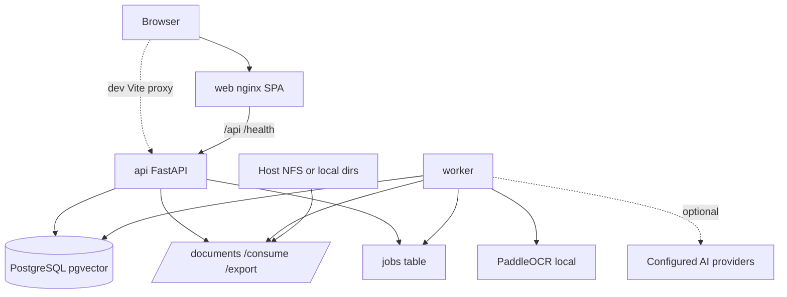

# Architecture overview

lesspaper-ngl is a **self-hosted document management system**. Organisation, OCR, and keyword search are core. Embeddings, filing suggestions, summaries, and Ask AI are **optional enhancements** that run only when administrators configure providers and policy allows them.

A new contributor should treat this document as the map; deeper pages in `docs/` are the atlas.

---

## Purpose

lesspaper-ngl lets an **Owner** ingest files (upload or consume folder), extract text locally, review them in **Inbox**, **Process** them into the **Library**, organise them with **logical folders** and tags, search evidence, and optionally ask questions with **validated citations**.

It is designed to run as Docker Compose on a homelab or NAS-backed host. PostgreSQL stays on a local Docker volume. Document blobs are bind-mounted (often NFS mounted **on the Docker host**, never by lesspaper-ngl itself).

---

## System boundaries

| Component | In / out of process | Role |
|-----------|---------------------|------|
| Browser | Client | SPA; cookies + CSRF |
| Frontend (`web`) | nginx container | Static UI; proxies `/api` and `/health` to API |
| Backend API (`api`) | FastAPI | Auth, CRUD, enqueue jobs, search, Ask |
| Worker (`worker`) | Same backend image | Jobs, consume poll, trash purge, AI health probes |
| PostgreSQL + pgvector | `db` container | Metadata, FTS, embeddings, job queue |
| Storage | Host bind mounts | `/documents`, `/consume`, `/export` |
| OCR | In-worker (PaddleOCR extra) | Local; models cached under Paddle cache dir |
| AI providers | External HTTP | Optional chat / embeddings / vision |
| Host NFS | Host OS | Optional backing for bind mounts |

---

## Runtime diagram

```text
Browser
   │  HTTP (same origin via web:9398, or Vite :8080 in dev)
   ▼
Frontend (nginx or Vite)
   │  /api /health  →  api:8000
   ▼
Backend API (FastAPI)
   │
   ├── PostgreSQL + pgvector
   ├── Storage (/documents, /consume, /export)
   └── Jobs table
          │
          ▼
       Worker
      /   |    \     \
   OCR  Index  Embed  Consume poll
         |              Trash purge
         └── optional AI HTTP (chat / embeddings)
```



---

## Main architectural flows

### Ingestion

**Confirmed:**

```text
Upload or Consume
  → persist original (content-addressed)
  → create Document (usually Inbox)
  → jobs: text_extraction + thumbnail
  → OCR job when PDF text is thin (if OCR enabled)
  → optional metadata_suggestion (auto_tagging + indexing-role model + privacy)
  → Inbox review (human)
  → Process
  → INDEXING job (chunks)
  → optional EMBEDDING and SUMMARY
```

**Exceptions (Confirmed):**

- Upload with an explicit library `folder_id` can skip Inbox (`inbox` false). After preflight, the worker may enqueue **INDEXING** without Process.
- Nested consume paths are stored as **pending folder path** on an Inbox document; folders under Documents root are created at Process, not at consume time.

### Retrieval

**Confirmed:**

```text
Browse (empty query)     → GET /api/documents (list + filters)
Evidence search (non-empty q)
  → POST /api/search
  → keyword (PostgreSQL FTS) and/or semantic (chunk vectors)
  → hybrid = Reciprocal Rank Fusion
```

If embeddings are unavailable, hybrid/semantic **falls back to keyword** (`effective_mode`).

### Ask AI

**Workspace Ask** (`POST /api/ask`) — **Confirmed** single request/response; no persisted conversation:

```text
Question + scope
  → resolve document IDs (library / folder / folder_tree / documents / search snapshot)
  → hybrid retrieve chunks (keyword ± semantic)
  → pack context budget
  → chat model
  → parse and validate [chunk:<uuid>] citations
```

**Document Ask** (`POST /api/documents/{id}/ask`) — **Confirmed** persisted thread (one conversation per owner+document): prior messages may be included up to `conversation_history_tokens`. Streaming is **not implemented**.

Insufficient evidence returns a canonical failure rather than unconstrained generation.

---

## Where logic lives

```text
HTTP API  →  domain services  →  SQLAlchemy models / PostgreSQL
                ↓
              enqueue Job
                ↓
              Worker handlers
```

The API is thin. Filing, ingest, Process, purge, and retrieval orchestration live in `folium.services.*` and `folium.workers.processor`. Search algorithms live in `folium.search.*`. RAG lives in `folium.ai.rag`.

---

## Readiness distinctions

Do not collapse these:

| Concept | What it means |
|---------|----------------|
| Inbox **Ready** | Preflight done and a filing target exists — ready to **Process** |
| `processing_status` | Coarse pipeline field on the document |
| **Keyword ready** | Chunks indexed (`document_indexed`); FTS may already work from preflight pages |
| **Semantic ready** | Chunks embedded in the active embedding space |
| **Ask ready** (UI) | `document_indexed` or `has_embeddings` |

Inbox Ready ≠ Keyword ready ≠ Semantic ready.

---

## Further reading

- [Runtime architecture](runtime-architecture.md)
- [Document lifecycle](document-lifecycle.md)
- [Data model](data-model.md)
- [Jobs and workers](jobs-and-workers.md)
- [Storage](storage.md)
- [Security and privacy](security-and-privacy.md)
- [Backend overview](../backend/overview.md)
- [Frontend overview](../frontend/overview.md)
